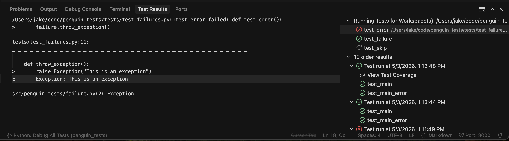

# Penguin Tests
POC sandbox to test out pytest functionality with a UI.

# Requirements
| Package | Install |
| --- | --- |
| [Allure 3 Report](https://allurereport.org/docs/v3/install/) | `npm install -g allure` |

# VSC / Cursor
## Running tests

| Action | Commands          | Description                                                                             |
| ----------------- | ----------------- | --------------------------------------------------------------------------------------- |
| Debugger | `cmd + shift + d` | Open the debugger panel. There will be a select box near the top of the explorer panel. From here you can press enter to run the debugger! |
| Run Debugger | `f5`              | Execute selected configuration while pausing for all active breakpoints                 |
| Run Debugger w/o breakpoints | `ctrl + f5`       | Executed selected configuration ignoring all breakpoints                                |
| Execute Test File | ` cmd + ;`   `cmd + shift + f` | Executes test in the current file |
| Debug Test File | ` cmd + ;`   `cmd  + f` | Debugs test in the current file |

## Tasks

| Action | Commands          | Description                                                                             |
| ----------------- | ----------------- | --------------------------------------------------------------------------------------- |
| Serve Allure UI | `cmd + shift + p`   `Tasks: Run Task`   `Open Allure Results Server` | Leverage the awesome UI to serve results with history included |

# Thoughts
- Using Cursor's test execution is quite nice because it uses the lower panel with current and historical runs

| Packages          | My Thoughts                                                                             |
| ----------------- | --------------------------------------------------------------------------------------- |
| pytest-html | HTML display seems to get good details but it's not very pretty. |
| pytest-csv              | Exporting CSV might be a great way to consolidate distributed test executions.                 |
| allure-pytest       | Wow, the Allure UI looks great! I like how there is a CLI that will serve it for my browser.  |

# TODO
- Disply aggregations of multiple test executions (emulate distributed testing framework).
- Display test executions over time to view patterns
